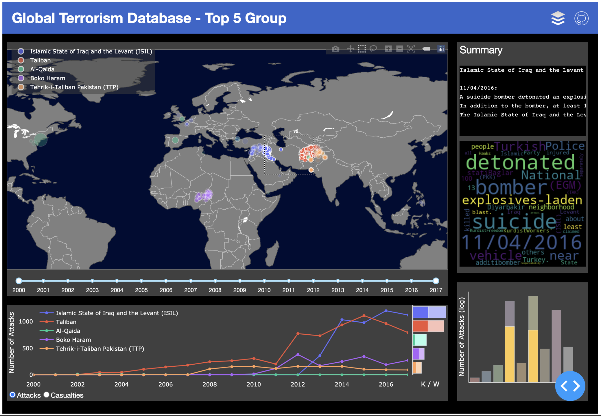
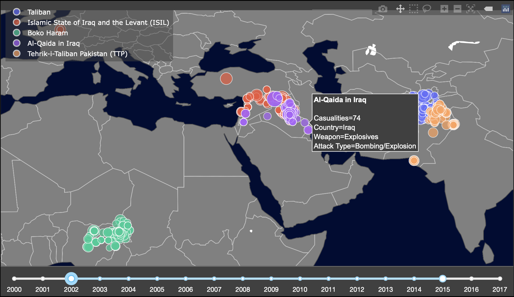
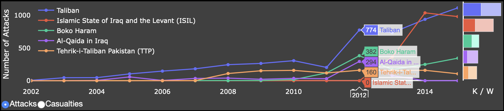

# Interactive Data Visulization with Dash

## Overview



## Dataset

The dataset - **Global Terrorism Database** is from [kaggle](https://www.kaggle.com/START-UMD/gtd).

## Plots

### 1. Global Map with Year Range Slider

A global map with dots represent each event. Different colors for dots to indicate groups listed in the legend. Users can panning, zooming in/out, hovering, and box/lasso select on the map. The legend can hide/reveal specific groups' events by clicking the group name. The year range slider constraints the events to be rendered in a given year range. Some of the interactions above lead to related changes on other plots.


### 2. Trending Lines with Horizontal Bar Chart

The trending lines show the number of attachs or casualites across years. When hover on trending lines, the exact number will reveal. Same as the lengend in Global Map, users can hide/reveal groups as they want. The horizontal bar shows the number of kills (darker bars) and wounds (lighter bars) with corresponding group color.


### 3. Summary and Word Cloud

It shows the summary of a given event when users hover on one in Global Map and the corresponding word cloud is generated as well.

<p align="center">
  
</p>

### 4. Bar Chart

Provides the number of attacks distributed in continents when users select a group of events in Global Map. The exact number shown when users hover on the highlighted bar.

<p align="center">
  
</p>

## Usage

1. Clone this repository:
   ```
   git clone https://github.com/blakechi/Interactive_Data_Visualization.git
   ```
2. Download the dataset from [kaggle](https://www.kaggle.com/START-UMD/gtd), and then put it under the folder `data` .
3. Under the project folder, install libraries and execuate:
   ```
   pip3 install -r requirements.txt
   python3 app.py
   ```
